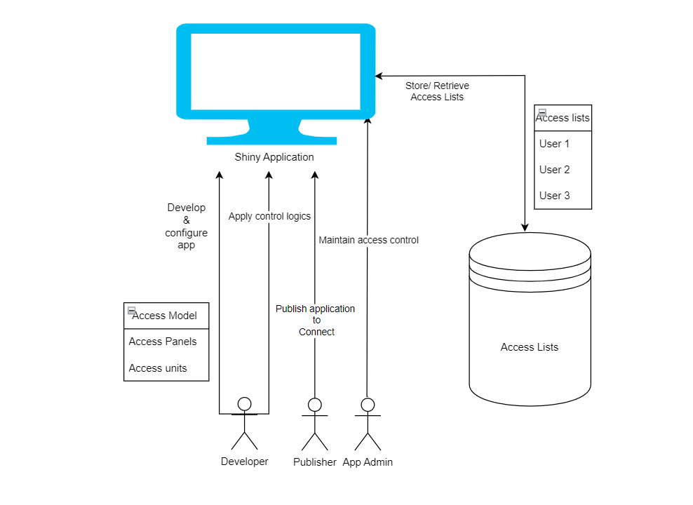

```{r, include = FALSE}
knitr::opts_chunk$set(
  collapse = TRUE,
  comment = "#>"
)
```

```{r setup}
library(rAccess)
```

## rAccess terminology

#### 1. Access Unit
The smallest unit that you want to control access to. It could be a specific module in the app, a single UI element, a collection of UI elements,	etc.

#### 2. Access Panel 
A container for a collection of Access Units. It can be used to implement deep layers of access control.

## Roles and responibilities

* App Developer  
* App Admin    
* App Publisher   

*App Developer* is responsible to find an *App Admin* to provide Access units and panels.  
*App Developer* will configure rAccess accordingly and implement the controlling logic in the app.  
*App Publisher* will work with *App Developer* to deploy the app with correct configuration and add the identified *App Admin* through the rAccess interface.  
*App Admin* is responsible to manage users assignments in rAccess interface.  

## Workflow



To use a rAccess security model, there are three distinct sets of actions that will be carried out by different roles.

**Design phase** :  

* App developer should identify Access Panels and a number of Access Units within each Access Panel.  

**Development phase** :  

* App developer lists the Access Panels and Access units in a config Yaml file.  
* App developer will implement the required server side controlling logic.  

**Publishing phase** :  

* App publisher will publish the app with the sharing settings of:  
    All users - login required  
* App publisher will assign the identified App Admin as an admin to the deployed app, using the rAccess interface.  

**Post-deployment** :  

* App admin controls and maintains access lists within the app. A nice shiny GUI is provided to facilitate this.  
* Audit trails are available for Access lists of all applications that utilize rAccess  

  * All past versions of Access lists per application are available  
  * For any particular application, one can obtain the effective access lists at a certain time in history (e.g. effective access list for application A at 10:52 on 10 April 2022.  

## Implementation
The `rAccess` package includes the ui and server module for the access control tab:

 * module_iam_ui()
 * module_iam_server()
 
and these could be plugged into the ui and server of the main application.

**module_iam_server()** takes the arguments:

  * `id` - Module id
  * `rAccess_obj` - An instance of the R6 class object `rAccess`

Once the `access panels` and `access units` are identified, the developer can create a new 
instance of the R6 object `rAccess`.

The parameters to the `rAccess` object can either be passed directly as arguments to the new
instance of `rAccess` or could be defined within a  configuration yaml file. 

### Adding rAccess config file
To add a config file template to your project directory use:

```
rAccess::use_config(file_name = "rAccess.yml")
```

## Config file structure

```
module: rAccess
parameters:
  app_name:                 # application name *
  board_type:               # local/rconnect/s3 *   
  access_mode:              # default/single unit
  unit_display:             # dropdown/switch
  switch_size:              # default/mini/small/normal/large
  user_df: !expr tibble::tribble(          
    ~userid, ~username,
    "UserID", "User Name")        # Sample user_df
  use_rconnect_users: TRUE        # TRUE - combine rconnect userlist with user_df
  secure_mode: FALSE              # TRUE - Access will be denied to users with no access to atleast one panel/unit
  local_board_path:               # Path to save local pin_board when board_type = "local"    
  s3_bucket:                      # s3 bucket name when board_type = "s3"      
  s3_access_key:                  # s3 access key when board_type = "s3" 
  s3_secret_key:                  # s3 secret key when board_type = "s3" 
  verbose: FALSE                  # If TRUE Prints all changes in the log

data:                             # Study data path if available  
  datapath1:     
  datapath2: 

panel_str:                        # Panel structure to be defined by the developer
  - access_panel: ADMIN           # Every App should have an ADMIN panel.(mandatory)

  - access_panel:                 # Access Panel name *
    access_units:
      - unit:                     # Access unit name  *
      - unit:                     # Access unit name

  - access_panel:                 # Access Panel name *
    access_units:
      - unit:
        data:                     # datapath associated with access unit  
      - unit:                     
        data:                     # datapath associated with access unit
```
### Parameters

* **app_name** Application Name. The same will be used as pin_name.

* **board_type** Takes values:
   + `"local"` for a local pin board.
   + `"s3"` for using s3 bucket to save pin board.
   + `"rconnect"` for rconnect pin board.
   
Pin_board is created using the `pins` package to store the access data. It could be a local folder when running the app interactively. When deployed to connect servers, the S3 bucket or rsconnect pin_board must be used. 

* **access_mode** - Enables user to select access modes.
Available access modes are :

   + `default` - Allows access to multiple access panels and multiple access units
   + `single unit` - Allows access to single access unit within an access panel.  

* **unit_display** - Defines the display type for access units in the ui. Takes values : 'switch', 'dropdown'.
It defaults to toggle switches.

* **switch_size** - Defines the size of toggle switches used in access control ui.
It takes values : 'default', 'mini', 'small', 'normal', 'large'. 

* **user_df** - A data frame with userid and username or NULL. If the `user_df` is provided, then the access module will search for potential users from within the given data frame in interactive mode. 

```
user_df <- tibble::tribble(
  ~userid, username,
  "UserId1", "User Name 1",
  "UserId2", "User Name 2",
  "UserId3", "User Name 3",
  "UserId4", "User Name 4",
  "UserId5", "User Name 5"
)
```

* **use_rconnect_users** Takes `TRUE/FALSE`. If TRUE the rconnect user list will be combined with the user_df. This will only affect the deployed apps in Posit Connect servers.

* **safe_mode** Takes `TRUE/FALSE` If TRUE then access to the app will be denied to users with no access to at least one panel/unit.

* **local_board_path** - Path to the local folder to save pin board when board_type = "local". Local pin_boards are mainly useful when the app running interactively, but you can also deploy the app with this option. However, you will lose the saved access lists if you re-deploy the app. By default the local path will be data folder in the root directory.

* **s3_bucket**, **s3_access_key**, **s3_secret_key** - S3 bucket credentials to be used when board_type = "s3". 

* **verbose** If TRUE Prints all data base changes in log. To be used for debugging.

### data

The study data path associated to the access units (if any) should be added in
this section as `dathapath1`, `datapath2`, ...

```
data: 
  datapath1: "testpath/data/path1"
  datapath2: "testpath/data/path2"

```

The datapaths will not be displayed anywhere in the access control UI but will be saved as part of the panel structure and developers can access them using `panel_config`. e.g. `newIAM$panel_config`  

### Panel Structure
The panel structure for each access panel is to maintained as given in the sample config file. 
Every access control module must have an 'ADMIN' panel and it has no units. This will be defined under panel_str as:

```
panel_str:
  - access_panel: ADMIN
```

All other access panels should follow the structure:

```
 - access_panel: "Access Panel 1" 
    access_units:
      - unit: "Unit 1"
        data: datapath1
      - unit: "Unit 2"
        data: datapath2
```

If there are multiple datapaths associated with an access unit then, it could be defined as:

```
- access_panel: "Access Panel 1" 
    access_units:
      - unit: "Unit 1"
        data: !expr c('datapath1', ''datapath2`)

```
### Creating a new instance of rAccess with Config file
Once the configuration file is ready the user can create a new instance of `rAccess` as below:

```
newIAM <- rAccess$new(user = "UserID", config = "rAccess.yml")
```
When deploying apps, you should always use `session$user` as the `user` to ensure the app recognizes who is currently logged in. 

## Demo {.tabset}
### demo_app.R without rAccess
```{r, results = FALSE}
library(shiny)

ui <- function() {
  navbarPage(
    "Demo!",
    tabPanel(
      "Plot",
      sidebarLayout(
        sidebarPanel(
          radioButtons(
            "plotType", "Plot type",
            c("Scatter" = "p", "Line" = "l")
          )
        ),
        mainPanel(
          plotOutput("plot")
        )
      )
    ),
    tabPanel(
      "Summary",
      verbatimTextOutput("summary")
    ),
    navbarMenu(
      "More",
      tabPanel(
        "Table",
        DT::dataTableOutput("table")
      ),
      tabPanel(
        "About",
        fluidRow(
          column(
            6,
            h1("this is a sample app")
          )
        )
      )
    )
  )
}

server <- function(input, output, session) {
  output$plot <- renderPlot({
    plot(cars, type = input$plotType)
  })

  output$summary <- renderPrint({
    summary(cars)
  })

  output$table <- DT::renderDataTable({
    DT::datatable(cars)
  })
}

shinyApp(ui, server)
```

### demo_app.R with rAccess
```{r, results= FALSE}
library(DT)
library(pins)
library(shiny)
library(rAccess)

ui <- navbarPage(
  id = "mainpage",
  title = "Demo!",
  tabPanel(
    "Plot",
    sidebarLayout(
      sidebarPanel(
        radioButtons(
          "plotType", "Plot type",
          c("Scatter" = "p", "Line" = "l")
        )
      ),
      mainPanel(
        plotOutput("plot")
      )
    )
  ),
  tabPanel(
    "Summary",
    verbatimTextOutput("summary")
  ),
  navbarMenu(
    "More",
    tabPanel(
      "Table",
      DT::dataTableOutput("table")
    ),
    tabPanel(
      "About",
      fluidRow(
        column(
          6,
          h1("this is a sample app")
        )
      )
    )
  ),
  tabPanel(
    "Access Control",
    rAccess::module_iam_ui("iam")
  )
)

server <- function(input, output, session) {
  # Add sample rAccess config file to the root directory
  if (!file.exists("sample_rAccess.yml")) {
    rAccess::use_config("sample_rAccess.yml")
  }

  # Create new instance of rAccess
  user_id <- ifelse(!exists("session$user"), "UserID", session$user)
  newIAM <- rAccess$new(
    user = user_id,
    config = "sample_rAccess.yml"
  )

  if (newIAM$no_admin() || newIAM$is_admin()) {
    showTab("mainpage", target = "Access Control")
  } else {
    hideTab("mainpage", target = "Access Control")
  }

  rAccess::module_iam_server("iam", newIAM)

  # Get panels with access
  user_access_list <- newIAM$get_user_accesslist()

  # Show/Hide: Access Control Panel
  if (newIAM$no_admin() || newIAM$is_admin()) {
    showTab("mainpage", target = "Access Control")
  } else {
    hideTab("mainpage", target = "Access Control")
    print("YOU DO NOT HAVE ADMIN ACCESS")
  }

  # Show/Hide: plot tab
  if (!"plot" %in% user_access_list[["sum"]]) {
    hideTab("mainpage", target = "Plot")
  } else {
    showTab("mainpage", target = "Plot")
  }

  # Show/hide the Summary Tab
  if (!"summary" %in% user_access_list[["sum"]]) {
    hideTab("mainpage", target = "Summary")
  } else {
    showTab("mainpage", target = "Summary")
  }

  # Show/hide the Table tab
  if (!"view" %in% user_access_list[["data"]]) {
    hideTab("mainpage", target = "Table")
  } else {
    showTab("mainpage", target = "Table")
  }

  # ----------------------------------------------------------------------------

  output$plot <- renderPlot({
    plot(cars, type = input$plotType)
  })

  output$summary <- renderPrint({
    summary(cars)
  })

  output$table <- DT::renderDataTable({
    DT::datatable(cars)
  })
}

shinyApp(ui, server)
```

### Sample config file
```
module: rAccess
parameters:
  app_name: demoApp                
  board_type: local                  
  access_mode: default             
  unit_display: 'dropdown'      
  switch_size: 
  user_df: !expr tibble::tribble(                   
    ~userid, ~username,
    "UserID", "User Name 1",
    "UserID2", "User Name 2",
  use_rconnect_users: TRUE        
  local_board_path:                   
  s3_bucket:                      
  s3_access_key:                  
  s3_secret_key:                  
  verbose: FALSE

data:
  datapath1:     
  datapath2: 

panel_str:              
  - access_panel: ADMIN 

  - access_panel: sum
    access_units:
      - unit: plot 
      - unit: summary

  - access_panel: data
    access_units:
      - unit: view    

```

## Audit trail functionalities

`rAccess` package also offers additional functions for performing audit trail activities.

* **get_accesshistory()** - Takes pin_board and pin_name as arguments and returns a list of access data created at different time points.
```{r}
pin_board <- pins::board_folder(path = "./data/")
get_accesshistory(pin_board, "demo")
```

* **get_accesslist()** - Takes pin_board, pin_name, datemin and datemax as arguments and returns  access list at a given date or in a specific time period.
```{r}
get_accesslist(pin_board, "demo", datemin = "2023-06-29")
```

* **get_admins()** - Takes pin_board, pin_name and admin_panel as arguments and returns the list of admins.
```{r}
get_admins(pin_board, "demo", "ADMIN")
```

* **get_board()** - Takes pin_board and pin_name as arguments and gather all pin_board elements.
```{r}
get_board(pin_board, "demo")
```
